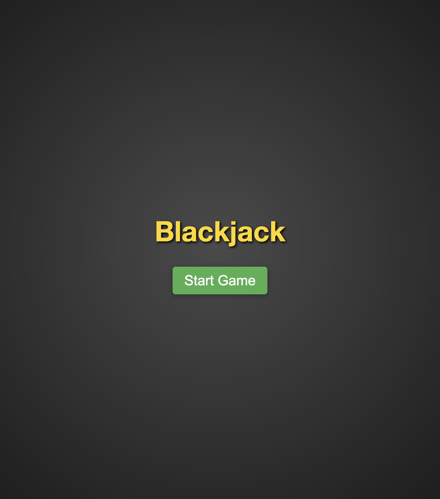
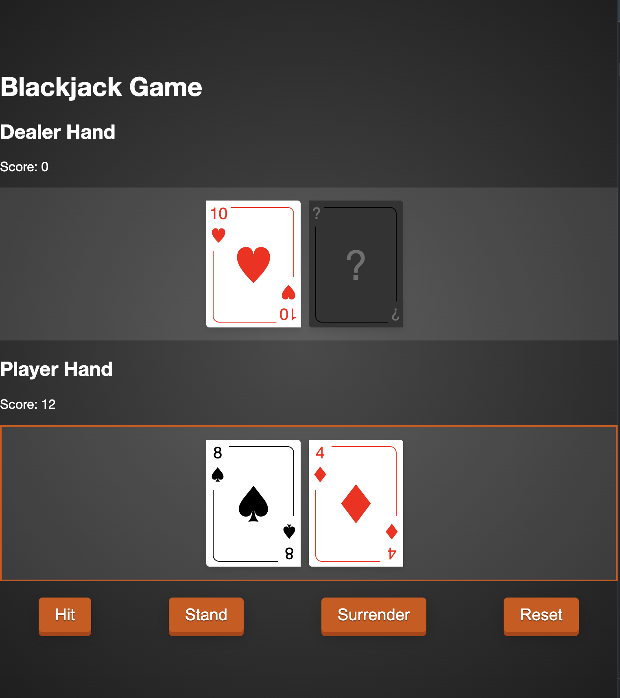
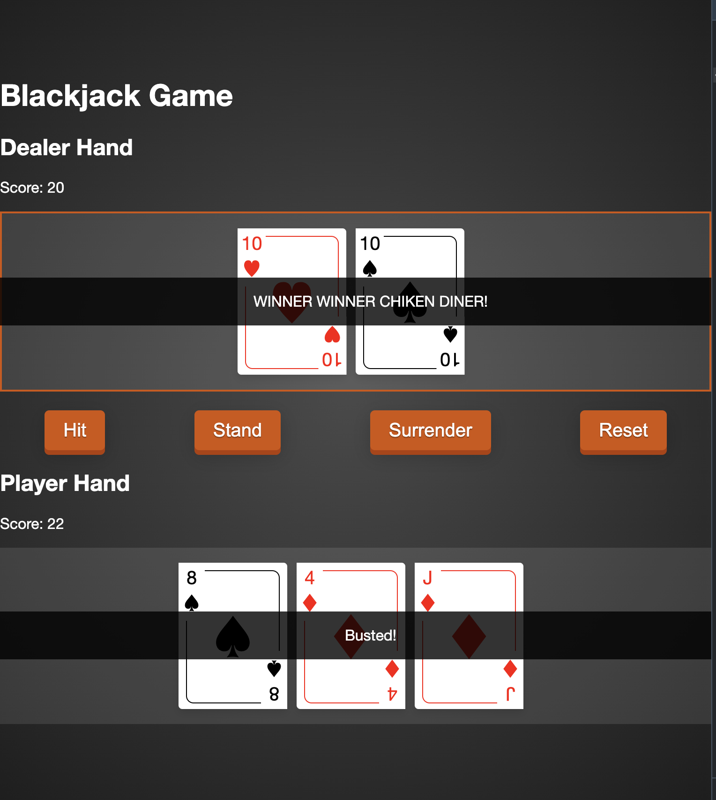
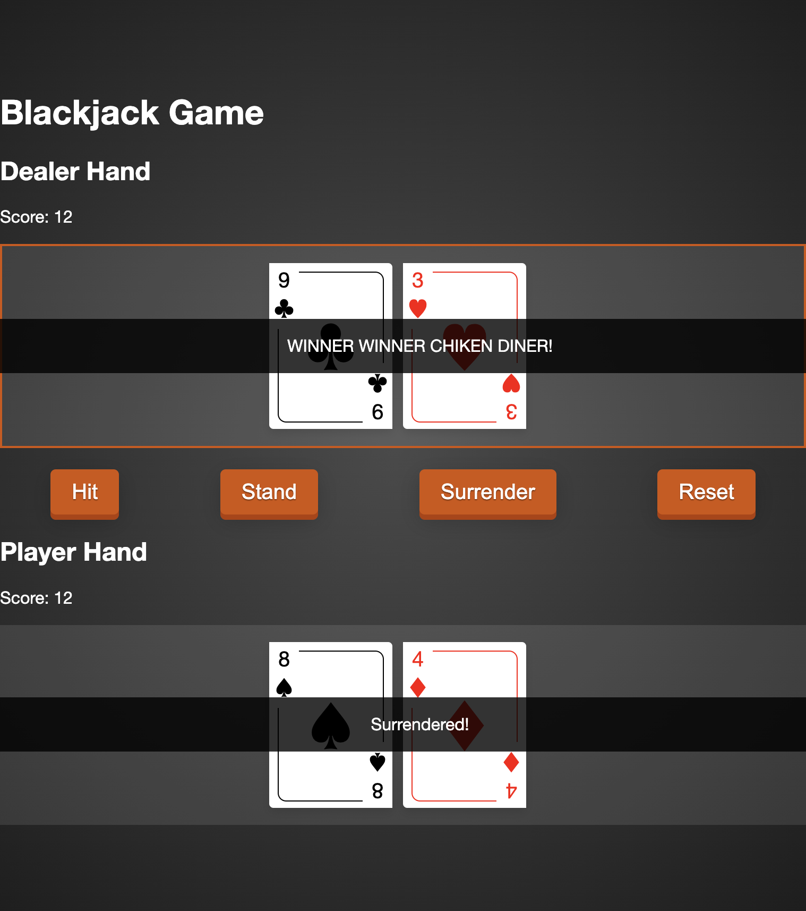

# Blackjack

Pure and plain HTML, CSS and Javascript Blackjack game developed to Engineering Hiring Challenge from Freestar.

## Features

- Hit, for a new card
- Stand, for ending turn
- Surrender, for game surrending
- Reset, game reset to initial state

## Installation

The project is using `http-server` libary to serve the project at http://192.168.3.39:8080/. Also it uses `testing-library` to DOM testing and `Jest` to classes unit testing.

To properly install and run the project, please run:

```bash
  npm ci
  npm run start
```

Afte you are able to find the project running at 8080 port at your localhost:

```
http://192.168.3.39:8080/
```

To run the test please run, make sure to have installed all dependencies before running it:

```
npm run test
```

## Screenshots










## Developed by

- Carlos Adriano Miranda
- cadriano.miranda@gmail.com
